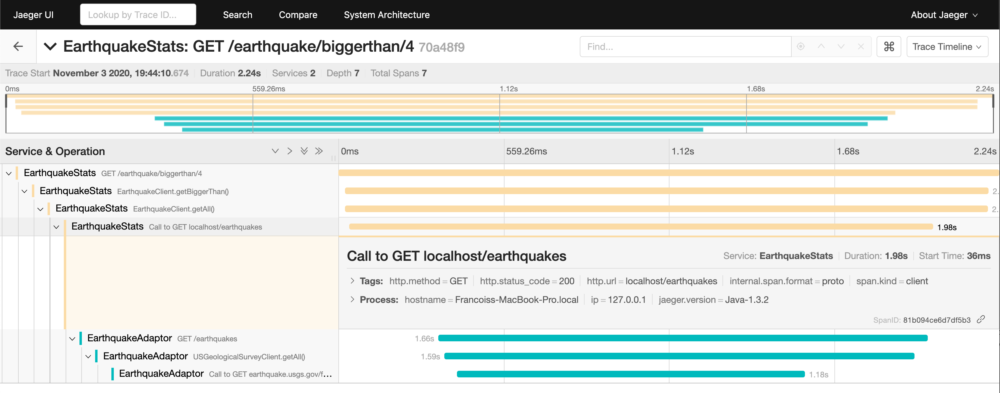

# Earthquake API - Span Naming Demo

Demo application consisting of two Ktor microservices instrumented with [ktor-opentracing](https://github.com/zopaUK/ktor-opentracing), illustrating the use of gradle tasks to name spans with the class and method name. 

* EarthquakeAdaptor retrieves data about earthquakes that happened today using an [API from the U.S. Geological Survey](https://earthquake.usgs.gov/fdsnws/event/1/).
* EarthquakeStats calls EarthquakeStats and exposes statistics about today's earthquakes such as `GET /earthquakes/latest` or `GET /earthquakes/biggest`. 

## Running

1. Start an [all-in-one Jaeger backend](https://www.jaegertracing.io/docs/1.20/getting-started/) with in-memory storage.

        docker run -d --name jaeger \
          -e COLLECTOR_ZIPKIN_HTTP_PORT=9411 \
          -p 5775:5775/udp \
          -p 6831:6831/udp \
          -p 6832:6832/udp \
          -p 5778:5778 \
          -p 16686:16686 \
          -p 14268:14268 \
          -p 14250:14250 \
          -p 9411:9411 \
          jaegertracing/all-in-one:1.20
             
2. Start the EarthquakeAdaptor application. 

        cd EarthquakeAdaptor
        ./gradlew run

3. Check that you can retrieve a list of today's earthquakes from EarthquakeAdaptor on localhost:8080.

        curl localhost:8081/earthquakes
        [ {
        "location" : "3km WSW of Ojai, CA",
        "magnitude" : 1.71,
        "timeGMT" : "2020-11-03 19:23:48"
        }, {
        "location" : "12km E of Alum Rock, CA",
        "magnitude" : 1.4,
        "timeGMT" : "2020-11-03 19:18:09"
        }, {
        "location" : "2 km E of Pāhala, Hawaii",
        "magnitude" : 2.35,
        "timeGMT" : "2020-11-03 19:05:47"
        }, {
        "location" : "12km SW of Searles Valley, CA",
        ...
                

4. Start the EarthquakeStats application. 

        cd EarthquakeStats
        ./gradlew run

3. Send some requests to EarthquakeStats on localhost:8080. Other routes available are `/earthquake/biggest` and `/earthquake/biggerthan/5` (where 5 is a parameter).

        curl localhost:8080/earthquake/latest
        {
          "location" : "21 km SSE of Karluk, Alaska",
          "magnitude" : 1.9,
          "timeGMT" : "2020-11-02 09:46:39"
        }  

5. See traces in Jaeger.

    http://localhost:16686/

7. Stop the Jaeger docker container.

        docker ps
        docker stop <containerId>

## Steps 

1. Import [ktor-opentracing](https://github.com/zopaUK/ktor-opentracing) and the [Java Jaeger client](https://github.com/jaegertracing/jaeger-client-java) ([commit](https://github.com/fstien/ktor-opentracing-span-naming-demo/commit/a80f28719890330dc7cf0fc9de645e69724179b2)).

        implementation "io.jaegertracing:jaeger-client:1.3.2"
        implementation "com.zopa:ktor-opentracing:0.1.1"

2. Instantiate a tracer and register it in [GlobalTracer](https://opentracing.io/guides/java/tracers/) ([commit](https://github.com/fstien/ktor-opentracing-span-naming-demo/commit/54d7775b1d38d4a19b060c57a8be166d485a7774)).

        val tracer = Configuration("earthquake-stats")
            .withSampler(Configuration.SamplerConfiguration.fromEnv()
                .withType(ConstSampler.TYPE)
                .withParam(1))
            .withReporter(Configuration.ReporterConfiguration.fromEnv()
                .withLogSpans(true)
                .withSender(
                    Configuration.SenderConfiguration()
                        .withAgentHost("localhost")
                        .withAgentPort(6831))).tracerBuilder
            .withScopeManager(ThreadContextElementScopeManager())
            .build()
        
        GlobalTracer.registerIfAbsent(tracer)

3. Install the `OpenTracingServer` feature into the application call pipeline ([commit](https://github.com/fstien/ktor-opentracing-span-naming-demo/commit/bc82ba2239d0ec6c19a899ad334376b8ff7dfb33)).

        install(OpenTracingServer)
        
4. Install the `OpenTracingClient` feature onto the http client ([commit](https://github.com/fstien/ktor-opentracing-span-naming-demo/commit/bc329cd63eb2bd85fdab82158d111f5db8467bd0)). 

        install(OpenTracingClient)

5. Instrument method calls using the `span` helper function ([commit](https://github.com/fstien/ktor-opentracing-span-naming-demo/commit/7e0cf72743760ec1f863017fd6da4c0427390778)).

        = span {

    From the lamdba expression passed to `span`, you can add tags or logs to the span by calling `setTag()` or `log()`.

6. In the `build.gradle`, add a task to copy the content of the `src` directory into an `intermediate` directory, then replace `span {` with `span(classAndMethodName(this, object {})) {` and `import com.zopa.ktor.opentracing.span` with `import com.zopa.ktor.opentracing.*`. The replacements import the `classAndMethodName` from `ktor-opentracing` and passes a call to it to the `span` function. This will name our span after the class and method name ([commit](https://github.com/fstien/ktor-opentracing-span-naming-demo/commit/36c0abb050d085b9f01337c14f5a8811708aecd2)). 

        task copyIntoIntermediateAndReplaceSpanName(type: Copy) {
                from 'src/'
                into 'intermediate/isrc/'
                filter { line -> line.replaceAll('span\\s+[{]', 'span(classAndMethodName(this, object {})) {') }
                filter { line -> line.replaceAll('import com.zopa.ktor.opentracing.span', 'import com.zopa.ktor.opentracing.*') }
        }

   Run this task manually to ensure that the copying and replacement works as expected. 

7. Set the source directory to be the directory to which the code was copied. This tells gradle to use to compile the source code in the `intermediate` directory when the build task is run ([commit](https://github.com/fstien/ktor-opentracing-span-naming-demo/commit/74592b4bd8220daf0fd48e2f42a64f35a1b6d77f)).

        sourceSets {
                main.kotlin.srcDirs = ['intermediate/']
        }

8. Configure IntelliJ to use the `src` directory for source code syntax highlighting. By default, only the source directory defined in the sourceSets above is highlighted. Hence without this configuration, you will no longer get syntax highlighting of your code ([commit](https://github.com/fstien/ktor-opentracing-span-naming-demo/commit/571d11d07ebe7718a94d8f360696c280912f225e)). 

        apply plugin: 'idea'
        
        ...

        idea {
                module {
                        sourceDirs = [file('src')].toSet()
                }
        }

9. Configure the `copyIntoIntermediateAndReplaceSpanName` task to run prior to compilation ([commit](https://github.com/fstien/ktor-opentracing-span-naming-demo/commit/d5dc916aa3919baccdbcd561b281091d886df270)). 

        compileKotlin.dependsOn ":copyIntoIntermediateAndReplaceSpanName"

   This ensures that the `intermediate` directory is present and contains the modified source code when the build task compiles our application. 

10. Finally, delete the `intermediate` directory after compilation as it is no longer needed ([commit](https://github.com/fstien/ktor-opentracing-span-naming-demo/commit/b8e28f4aeb1295d89290e6d1432dd0c3f6aa6c97)). 

        task deleteIntermediate(type: Delete) {
                delete "intermediate"
        }

        compileKotlin.finalizedBy(deleteIntermediate)

